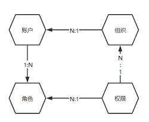

# 区块链组织

## 创建初始网络

联盟链顶层管理角色（委员会）叫做**网络管理组（Network Administrator）**，可设有*多名*网络管理员，以及一级**组织（Organization）**内的管理员共同参与。

## 添加新组织并设置网络管理员

​以网络管理组为root，可以向下建立各层级组织。

​组织内可添加*多个*账号，账号可赋予*多种*角色。

​组织层级结构如下图所示。

组织、账号、角色对应关系如下图所示。

- 网络管理组（Level 0）：设有网络管理员，链启动后初始化。

- 组织（Level 1）：由网络管理员创建，需要通过网络管理员们投票，半数以上批准同意。

- 子组织（Level 2-N）：由*祖先的*组织管理员创建，不能由网络管理员创建。不需要投票。

组织的增删改查具有**状态属性（Status）**，状态及转移过程如下图所示，其中Leve1组织添加、冻结、激活、恢复、撤销等全生命周期的状态转换等需要网络管理员**投票(Vote)**。

## 节点、账本与智能合约

区块链网络主要由**节点（Peer）** 组成。节点是网络的基本元素，因为节点存储了**账本（Ledger）**和智能合约（Smart Contract）。账本不可篡改地保存着智能合约生成的所有交易。智能合约和账本将网络中共享的*流程*和*信息*对应地封装起来。

- 节点：节点可以被创建、启动、停止、重新配置甚至删除。他们暴露了一系列的 API，这就可以让管理者和应用程序同这些 API 提供的服务互动。

- 智能合约：作为受信任的分布式应用程序，从区块链中获得信任，在节点中达成基本共识。它是区块链应用的业务逻辑。

- 账本：账本记录着一个业务对象当前状态，以及与促成这一当前状态的所有交易历史。

## 完善网络
