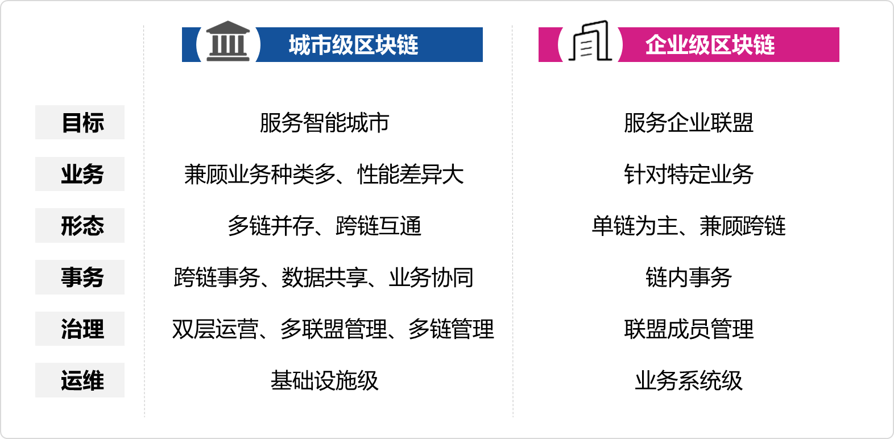

# 简介
&emsp;&emsp;雄安自主可控区块链底层基础平台的总体定位是构建雄安新区“城市级”可信技术基础设施，其使命任务是服务于雄安新区新型智能城市建设。“城市级”区块链在目标、业务、形态、事务、治理、运维等六个维度，与现有的“企业级”区块链有较大不同.

&emsp;&emsp;除了目标定位与“企业级”区块链不同，城市级区块链与企业级区块链的区别还包括以下几个方面。在业务种类方面，城市级区块链面临的应用场景和业务种类繁多，不同业务类型之间性能差异大，要求城市级区块链具备兼顾应用多样性的能力、具备功能性能伸缩性能力；在区块链系统形态方面，城市级区块链必将呈现出多链共存格局，面临多链互联互通互操作需求；在区块链应用事务方面，城市级区块链需具备不用应用链之间的跨链事务处理能力，具备区块链系统与外部信息系统（例如电子政务系统等）的交互能力，包括外部系统输入信息链上存储，以及链上信息事件驱动外部信息系统操作等；在区块链治理方面，城市级区块链的治理对象包括多个联盟、多个组织、跨联盟管理等，要求具备联盟之内与联盟之上治理能力，呈现出“双层运营与治理”特性；在区块链运维方面，将作为城市的新技术基础设施（新基建）要素，作为“城市操作系统”的一部分进行运营，建设模式和运营模式与业务系统级别的企业级区块链有所不同。

&emsp;&emsp;在雄安新区建设新型智能城市背景下，区块链底层基础平台将作为城市级区块链基础设施的核心软件，提供满足各类业务需求的应用级区块链服务，为城市治理和服务提供可信基础设施功能。在硬件资源层，借助“雄安云”的弹性服务，区块链基础设施将具备节点按需部署、动态扩容能力；在数据层，与“块数据平台”结合，可为数据确权、数据共享交换、以及数据治理提供技术支撑。